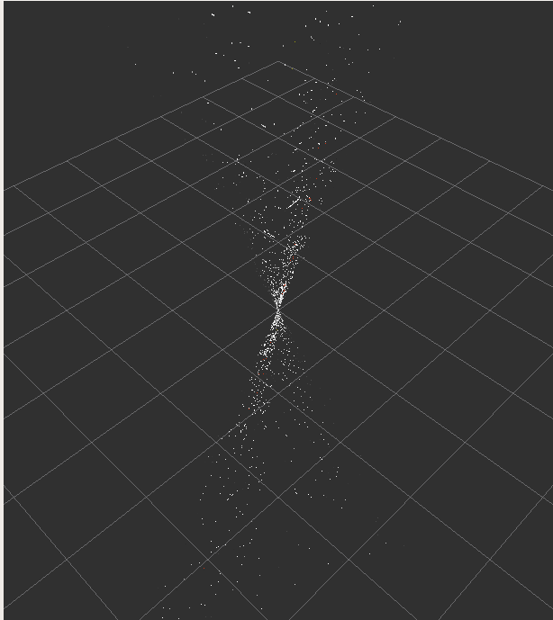
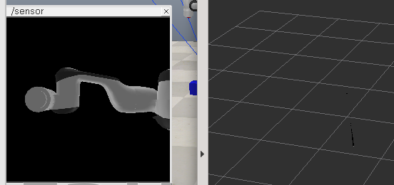
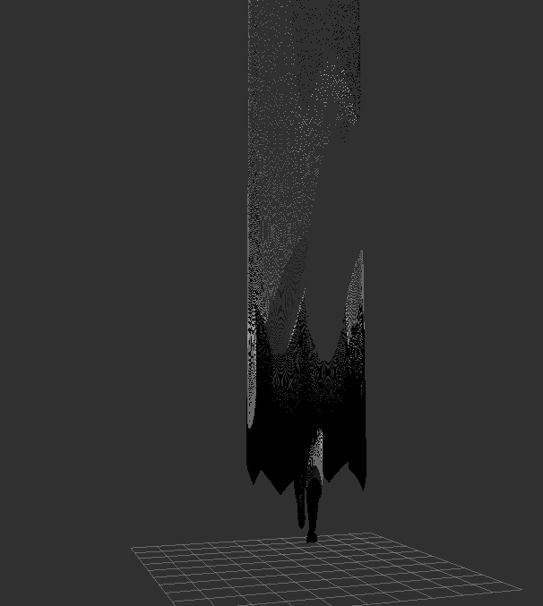
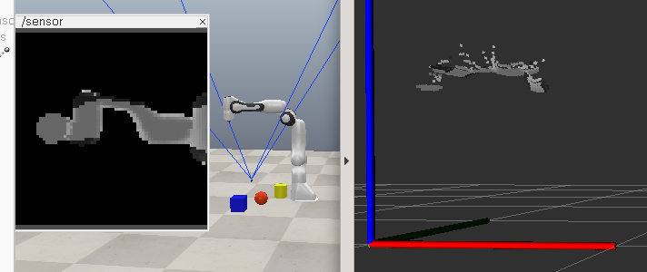
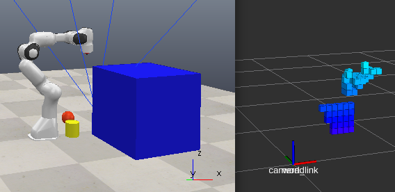
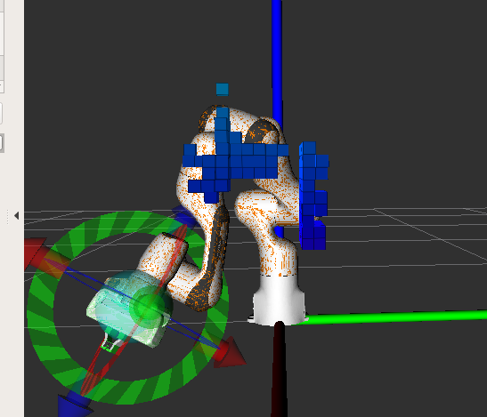

# Vrep与Moveit联合仿真
### 问题1：vrep里订阅到了数据，但是仿真环境里的机械臂不会动
解决方法：subscriber_callback里的关节位置设置不能用sim.setJointPosition，应该使用sim.setJointTargetPosition。在动力学模式下，必须使用sim.setJointTargetPosition。

### 问题2：vrep在刚运行时第一次订阅到的position只有8个元素，且顺序是错乱的。在后续的执行中顺序和第一次的不一样。所以vrep订阅到信息之后无法直接遍历执行关节控制
分析：从rostopic echo /joint_states里看到的position内容顺序一直都是正确的且不变的。除了position，还包含了joint_name的信息，且joint_name数据不是以数组类型存放，猜测可能与joint_name的顺序有关。
解决方法：先通过joint name来确定关节1,2,3,4,5,6,7分别在position数组中的索引，然后一一对应取出进行控制即可。通过一两个实验证明，确实是与joint name的顺序有关。

# 深度图像转成点云信息
### 问题3：rviz没有显示点云，报“No tf data. Actual error: Fixed Frame[map] dose not exist”
解决方法：在launch文件里边添加一个tf_ros2节点发布world即可。因为当前的环境中一个坐标系都不存在。

### 问题4：rviz里的点云显示不正确
#### 1、确定相机内参以及外参是否都正确。
相机内参和外参计算正确，但依然得到下图所示结果   

#### 2、把读取的深度值d == 0的判断部分添加 d <= 1e-5，因为通过打印可以看到有很多非常接近零且是负数的值
修改之后，rviz里显示的点云图像只剩下上半部分，但依然不正确
#### 3、在图像上取出一个像素坐标点，打印出来的深度值d = 256008749056，很显然不对，太大了。应该编码的问题，但是vrep发布的信息编码方式是32FC1，图像转点云的代码中也是32FC1类型的cv::mat。
1. 在图像转点云的代码里把cv::mat进行image show查看图片，图片能看出机械臂形状，不过是彩色的，主要是橘色
2. 打印cv::mat的类型，是24-8UC4。这一步就感觉有点莫名其妙，明明前边调用cv_bridge::toCvCopy()方法进行了数据类型转换，应该转换成32FC1的。
3. 查看cv_bridge的源代码，toCvCopy()方法里边在进行cv::mat数据类型转换前，先调用了matFromImage()的方法将sensor_msgs::Image的数据类型转换成了cv::mat
4. 查看matFromImage()方法发现，原来如果数据存储方式是小端，那么会按照sensor_msgs::Image里指定的encoding方式转成cv::mat，但如果数据存储方式是大端，那么指定为32FC1的encoding的数据就会被转成8UC1
5. 在cv_bridge::toCvCopy()中，如果当前指定的encoding和目标encoding方式是相同的，那么就默认不会进行转换了，直接copy。因此就从4里描述的8UC1直接copy了。导致最终的结果显示数据没有转换成功。
解决方法：将vrep发送的信息中is_bigendian改成false就可以了，深度值总算是比较正常的了。
点云显示依然不正确，变成如下图片   

#### 4、对比vrep和cv::map里深度值，match不上
解决方法：vrep对深度值信息进行了归一化处理， distance = d * (maxDis - minDis) + minDis  其中，minDis表示相机能照到的最近距离，maxDis表示相机能照到的最远距离。
不过，还是显示不正确，变成了   

#### 5、没有正确理解深度值的意义。已知以为是欧式距离，但其实是点到相机关心在光轴方向上的距离，即zc的值
解决方法：d = zc进行计算即可得到正确点云   

### 问题5：rivz机械臂和vrep里机械臂的运动状态不一致
分析：ros里和vrep里Franka模型每个对应的关节都可能坐标系姿态不一致的情况
解决方案：对比两个环境机械臂同样的状态下每个关节的关节角，然后进行相应的加减来对齐

### 问题6：出现“Transform error: Lookup would require extrapolation into the future. Requested time xxx but the latest data is at time xxx, when looking up transform from frame [panda_link1] to frame [world]”
分析：点云转换文件的节点不执行时，不会报这个错误。所以问题出现在了这个节点上。这个节点跟tf以及时间有关的只有两个设置，一是frame_id，二是stamp。frame_id设置的world，这个没有太大问题，那么问题就出在了stamp时间戳上。
解决方案：把时间戳设置成stamp = ros::Time(0)，world坐标系在被点云转换节点订阅的时候，world时间戳会取最近的历史时间戳，这样就能保证机器人各坐标系与world坐标系之间的时间戳时间顺序保持正确。之前使用的是ros::Now()，这应该是导致了world坐标系的时间戳被更新成了一个新的时间，且在机器人各关节坐标系时间戳之后，所以导致报错。

### 问题7：rviz里显示的octomap障碍物位置和vrep里摆放的位姿不完全一致  

原因：相机外参没有求对
解决方案：通过观察的方式，在相机坐标系下，在x方向上沿z轴对称了。在计算xc时添加一个负号即可。（但是为什么呢？明明世界坐标系和相机坐标系的姿态是一样的啊，旋转矩阵R是单位矩阵才对啊）

### 问题8：障碍物移走了，但是rviz里显示的octomap清除不存在的障碍物，只会继续添加新的。
分析：github上有人也提出这个问题，但是没有得到解决。有人定位了一下，在pointCloudOctoMapUpdater的源文件中的free_cells是有被更新的，但是planning scene没有更新。github上还有人说，可以用depthOctomapUpdater，速度会比较快，可能就没有这个问题了。自己直接用octomap_server生成octomap也同样出现了这个问题，所以pointCloudOctoMapUpdater里的实现大概率是没问题的。而用深度图直接转成octomap估计也会有这个问题。
解决方案：（未实施）通过图像检测的技术来发送一个清除octomap的信号，一旦有物体在移动，那么就按照某个频率发送清除信号。不过这个频率不能太高，否则直接就不生产octomap了。但如果太低，延迟又过大。

### 问题9：机械臂运动过程中，某些位置被处理成occupied了   

未解决

